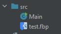
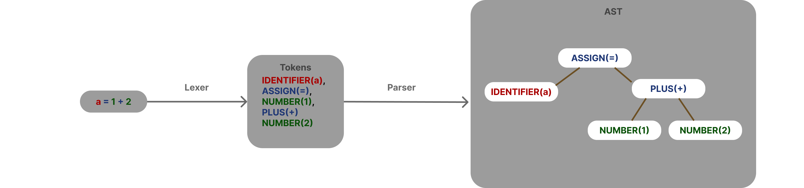
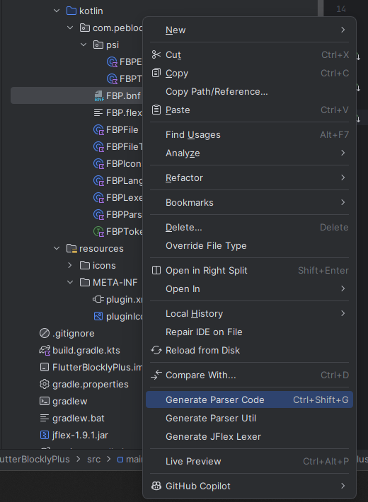
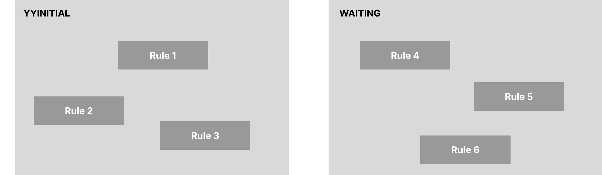
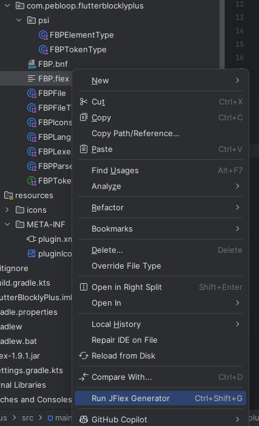
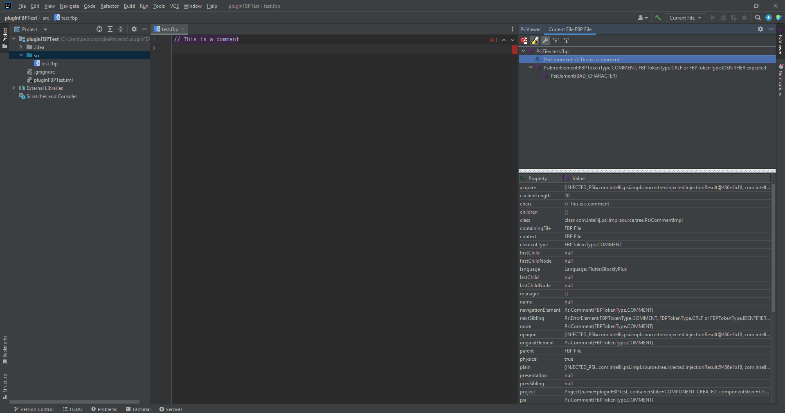

# How to create your own language plugin for Jetbrains IDEs (part 1)

To set the context, I'm working on a flutter project that use blockly. The thing is that blockly is a javascript library. First thing I did was to search a lib that could help me to use blockly in flutter. I found a package called [flutter_blockly](https://pub.dev/packages/flutter_blockly) that is a wrapper for blockly.

The problem is that this package lack a lot of features that I need. So I decided to fork it and create my own package : [Flutter Blockly Plus](https://pub.dev/packages/flutter_blockly_plus) (FBP).

Now when you want to inject javascript into the webview that contain blockly you have to do it either by using a file or by using a string directly in the dart code. In both cases you will lack auto-completion and other usefull developement features and it's unconvenient.

All that lead to the current day where I decided to create a plugin for Jetbrains IDEs that will help me to write the javascript code that I will inject into the webview.

In this part we will focus on the creation of the AST (Abstract Syntax Tree).

## Step 1: Install the necessary tools

To create a plugin for Jetbrains IDEs you will need **Intellij IDEA**. You can download it from [here](https://www.jetbrains.com/idea/download/).

You'll also need to install 2 plugins, the first is the [gradle plugin](https://plugins.jetbrains.com/plugin/13112-gradle) and the second is the [Plugin devkit](https://plugins.jetbrains.com/plugin/22851-plugin-devkit).

## Step 2: Create a new project

Open Intellij IDEA and create a new project. Choose **IDE Plugin**, fill in the necessary information and click on **Create**.

## Step 3: Create a language

Now that we're set up, we can start creating our language.

Create a new class in the `src/main/kotlin/*your package path*/` directory and name it `*Your language Name*Language.kt`. For example I named it `FBPLanguage.kt`.

The class must inherite `Language`, contain a static (or compagion object) instance of itself and it's contructor must call the super constructor with the name of the language.

```kt
import com.intellij.lang.Language

class FBPLanguage() : Language("FlutterBlocklyPlus") {

    companion object {
        val INSTANCE: FBPLanguage = FBPLanguage();
    }

}
```

## Step 4: Create a file type

Jetbrain IDEs detect files languages by their extension. So we need to create a file type for our language.
Create a ne class in the same directory as before and name it `*Your language Name*FileType.kt`. For example I named it `FBPFileType.kt`.

The class must inherite `LanguageFileType`, contain a static (or compagion object) instance of itself and it's contructor must call the super constructor with the instance of the language we created before.

```kt
class FBPFileType() : LanguageFileType(FBPLanguage.INSTANCE) {

    companion object {
        val INSTANCE: FBPFileType = FBPFileType()
    }
}
```

Now, we need to implement some methods that are required by the `LanguageFileType` class.

```kt
    override fun getName(): String {
        return "FlutterBlocklyPlus"
    }

    override fun getDescription(): String {
        return "FlutterBlocklyPlus file"
    }

    override fun getDefaultExtension(): String {
        return "fbp"
    }

    override fun getIcon(): Icon {
        return
    }
}
```

The methods are kinda self-explanatory :
- `getName` returns the name of the file type.
- `getDescription` returns the description of the file type.
- `getDefaultExtension` returns the default extension of the file type.
- `getIcon` returns the icon of the file type.

For this last method, let's create an icon.

Create a class that will store our icons and store you icon in `src/main/ressources/` directory. You can also create an `icons` directory to sort your resources.

```kt
class FBPIcons {
    companion object {

        val FILE: Icon = getIcon("/icons/pluginIcon.svg", FBPIcons::class.java);
    }
}
```

Now we can add the icon to our file type.

```kt
class FBPFileType() : LanguageFileType(FBPLanguage.INSTANCE) {

    companion object {
        val INSTANCE: FBPFileType = FBPFileType()
    }

    @NotNull
    override fun getName(): String {
        return "FlutterBlocklyPlus"
    }

    override fun getDescription(): String {
        return "FlutterBlocklyPlus file"
    }

    override fun getDefaultExtension(): String {
        return "fbp"
    }

    override fun getIcon(): Icon {
        return FBPIcons.FILE
    }
}
```

## Step 5: Time to test !

Now it's time to ensure that everything is working fine.
In the far right click on the `Gradle` tab and in `intellij` folder execute `runIde`. A new IDE will open, create a new project and create a new file with the extension you defined in the file type. You should see the icon you defined in the file type.



## Step 6: Parser

Now that we have our language set up, we need to analyse the code. It's a neccessity to have auto-completion and other features that will help us to write our "special javascript" code.

### How it works

But how can we do that ? With a parser ! Well, let's do some theory first.

To analyse code Jetbrain IDEs use a tool called PSI (Program Structure Interface). It's a layer of the IDE that parse the code and create a tree of the code structure. This tree is called AST (Abstract Syntax Tree).

First, the code go through a lexer that split the code into tokens. Then the parser will create the AST.

    Side note : the parser can mean the whole process or just the part that create the AST. 

To better understand how it works, let's take an example. Let's say we have the following code :

```js
a = 1 + 2
```

Firstly, our code will go through something called lexer. The lexer will split the code into tokens. In our case it will split the code into elements and convert them into tokens. :

```js
IDENTIFIER(a), ASSIGN(=), NUMBER(1), PLUS(+), NUMBER(2)
```

After the lexer, the parser will create the AST. The AST is a tree that represent the structure of the code. In our case it will look like this :

```
            ASSIGN(a)
            /       \
IDENTIFIER(a)       PLUS
                    /   \
                NUMBER(1) NUMBER(2)
```

Here's the whole process :



Once you have the AST you can analyse the code and do whatever you want with it, like auto-completion, error detection, etc.

Now that we know how it works, let's implement it. In jetbrain, the class that contain the whole parser is the `ParserDefinition` class.

```kotlin
class FBPParserDefinition: ParserDefinition {

    val FILE: IFileElementType = IFileElementType(FBPLanguage.INSTANCE)

    override fun createLexer(p0: Project?): Lexer {
        return FBPLexerAdapter()
    }

    override fun createParser(p0: Project?): PsiParser {
        return FBPParser()
    }

    override fun getFileNodeType(): IFileElementType {
        return FILE
    }

    override fun getCommentTokens(): TokenSet {
        return FBPTokenSet.COMMENTS
    }

    override fun getStringLiteralElements(): TokenSet {
        return TokenSet.EMPTY
    }

    override fun createElement(p0: ASTNode?): PsiElement {
        return FBPTypes.Factory.createElement(p0)
    }

    override fun createFile(p0: FileViewProvider): PsiFile {
        return FBPFile(p0)
    }


}
```

Don't worry about all those classes that are not defined yet. We will go step by step.

### Tokens and elements

We will start by creating the tokenType and the element types. If what a tokenType is can be easily understood, an element type is a generic type that represent all different types of elements in the PSI. A token is an element, the file that define the whole parser is an element, etc.

[More information about elements here](https://plugins.jetbrains.com/docs/intellij/psi-elements.html)

so let's create an element, I personnaly put thoses files in a `psi` directory. 
```kotlin
class FBPElementType(debugName: String) : IElementType(debugName, FBPLanguage.INSTANCE) {}
```

Let's also create a token type. As said before, a token is an element, so it will inherite from `FBPElementType` (and not FBPElementType !).
```kotlin
class FBPTokenType(debugName: String) : IElementType(debugName, FBPLanguage.INSTANCE) {
    override fun toString(): String {
        return "FBPTokenType." + super.toString()
    }
}
```

### The parser

Now that our types are defined, we can define our parser. For that we will write a BNF (Backus-Naur Form) file that will define the structure of our language, and will help us to generate the parser.
The file has two parts, the first part is the metadata of the file and the second part is the rules of the language.

```bnf
{
    *Metadata*
}

*Rules*
```

Let's start with the metadata, they will help us to generate the parser.

```bnf
{
    parserClass="com.pebloop.flutterblocklyplus.psi.FBPParser"

    extends="com.intellij.extapi.psi.ASTWrapperPsiElement"

    psiClassPrefix="FBP"
    psiImplClassSuffix="Impl"
    psiPackage="com.pebloop.flutterblocklyplus.psi"
    psiImplPackage="com.pebloop.flutterblocklyplus.psi.impl"

    elementTypeHolderClass="com.pebloop.flutterblocklyplus.psi.FBPTypes"
    elementTypeClass="com.pebloop.flutterblocklyplus.psi.FBPElementType"
    tokenTypeClass="com.pebloop.flutterblocklyplus.psi.FBPTokenType"

}
```
Here's what each line means :
* `parserClass` : This is the name of the parser class that will be generated when we will process the BNF file.
* `extends` : The class that the parser will inherit from.
* `psiClassPrefix` : The prefix of all the files that will be generated. For exemple the `*Property* file will be named *FBPProperty*.
* `psiImplClassSuffix` : The suffix of the implementation class. For exemple the `*Property* file will be named *FBPPropertyImpl*.
* `psiPackage` : The package of the generated files.
* `psiImplPackage` : The package of the implementation files.
* `elementTypeHolderClass` : The class that will hold all the element types.
* `elementTypeClass` : The class that we created that define an element type.
* `tokenTypeClass` : The class that we created that define a token type.

Once completed, we can start to write the rules. Jetbrain actually has an article covering the topic [here](https://github.com/JetBrains/Grammar-Kit/blob/master/HOWTO.md). In this we will only cover the basics.

Our code is stored in a file, and our file is composed of elements that define our language. So let's write this in our file :
```bnf
FBPFile ::= item_*
```
* `FBPFile` is the file that contain the code.
* `::=` means "is composed of".
* `item_*` means "0 or more items".

So basically, what we just wrote is *"A FBPFile is composed of 0 or more items"*.

Now let's define what an item is. Let's say that an item of our code is either a property, a comment or a new line :
```bnf
private item_ ::= (property|COMMENT|CRLF)
```
* `private` means that this rule is not accessible from the outside.
* `item_` is the name of the rule.
* `::=` still means "is composed of".
* `property` is a the generic element of our language. We will define it later.
* `COMMENT` is a comment.
* `CRLF` is a new line.

Note the `|` between the elements. It means "or". An item is either a property, a comment or a new line.

Also, `COMMENT` and `CRLF` are our tokens generated by the lexer. For now we don't have a lexer, so we will define them later.

Now let's define what a property is. Let's say that a property is composed of an identifier, an equal sign and a value like this:
```js
a = 3
```
```bnf
property ::= IDENTIFIER EQ PRIMITIVE
```
More tokens ! We also define them later.
We'll stop here for the BNF file. Let's generate the parser.

To generate the parser, right click on the BNF file and click on `Generate Parser Code`. A new directory will be created in the `src/main/gen` directory. This directory will contain all the generated files.



Note thqt in the *Your Language name*Types.kt file (FBPTypes for exemple), the tokens used in the parser are automatically generated.

```kotlin
public interface FBPTypes {

  IElementType PROPERTY = new FBPElementType("PROPERTY");

  IElementType COMMENT = new FBPTokenType("COMMENT");
  IElementType CRLF = new FBPTokenType("CRLF");
  IElementType EQ = new FBPTokenType("EQ");
  IElementType IDENTIFIER = new FBPTokenType("IDENTIFIER");
  IElementType PRIMITIVE = new FBPTokenType("PRIMITIVE");

  class Factory {
    public static PsiElement createElement(ASTNode node) {
      IElementType type = node.getElementType();
      if (type == PROPERTY) {
        return new FBPPropertyImpl(node);
      }
      throw new AssertionError("Unknown element type: " + type);
    }
  }
}
```

Since the generated files are in `gen` and not in `main`, we need to add the `gen` directory to the sources. To do that, add this following line in the `build.gradle` file :

```gradle
sourceSets["main"].java.srcDirs("src/main/gen")
```

### The lexer

We're halfway to be able to generate our AST, yay ! Now we need to define our lexer. Since the lexer will split the code into tokens, we need to define them. For that we will create a *flex* (Fast Lexical Analyzer Generator) file that will be generated by the IDE with [Jflex](https://jflex.de/manual.html).
Here our file structure :

```flex
*Package*
*Import*
%%
% {
*Variables*
}

*Constants*
%%
*Rules*
```

Let's start by the imports (and the package). We need to import the generated files and the classes that we will use.

```flex
package com.pebloop.flutterblocklyplus;

import com.intellij.lexer.FlexLexer;
import com.intellij.psi.tree.IElementType;
import com.pebloop.flutterblocklyplus.psi.FBPTypes;
import com.intellij.psi.TokenType;
```

Now let's define the variables (do not forget the `%%` wetween the imports and the variables).

```flex
%class FBPLexer
%implements FlexLexer
%unicode
%function advance
%type IElementType
%eof{  return;
%eof}

%state WAITING_SEPARATOR
```
* `%class` : The name of the class that will be generated.
* `%implements` : The interfaces that the class will implement.
* `%unicode` : The encoding of the file.
* `%function` : The function that will be called when the lexer will advance.
* `%type` : The type of the token.
* `%eof` : The function that will be called when the lexer reach the end of the file.

* `%state` : A state of the lexer.

You might wonder what is a state ? Well a state is a way to define different rules for the lexer. For exemple, when the lexer is in the `WAITING_SEPARATOR` state, it will not use the same rules as when it's in the default state. You can see them like a container of rules. You can define as many states as you want. The initial state the lexer is in is `<YYINITIAL>`.



Now let's define the rules, the format of the rules is the following :
```flex
<STATE> {
  expr1   { action1 }
  expr2   { action2 }
}
```

Let's with a simple example. Let's say that we want to define a rule that will match a comment. A comment start with `//` and end with a new line. So the rule will be :
```flex
<YYINITIAL> {
  "//" [^\n]* { return FBPTypes.COMMENT; }
}
```
* `<YYINITIAL>` : The initial state of the lexer.
* `"//"` : The start of the comment.
* `[^\n]*` : Any character that is not a new line.
* `{ return FBPTypes.COMMENT; }` : Return the token type of the comment.

For now we don't use the `WAITING_SEPARATOR` state, but we will come back to it later. For now here is the whole lexer :

```flex
package com.pebloop.flutterblocklyplus;

import com.intellij.lexer.FlexLexer;
import com.intellij.psi.tree.IElementType;
import com.pebloop.flutterblocklyplus.psi.FBPTypes;
import com.intellij.psi.TokenType;

%%

%class FBPLexer
%implements FlexLexer
%unicode
%function advance
%type IElementType
%eof{  return;
%eof}

%state WAITING_SEPARATOR
%%

<YYINITIAL> {
  "//" [^\n]* { return FBPTypes.COMMENT; }
}
```

Finally, we need to generate the lexer. Right click on the flex file and click on `Run JFlex Generator`. A new file will be created in the `src/main/gen` directory.



To have your lexer working with jetbrain, you need to create a LexerAdapter that will adapt the generated lexer to the jetbrain lexer.

```kotlin
package com.pebloop.flutterblocklyplus

import com.intellij.lexer.FlexAdapter

class FBPLexerAdapter(): FlexAdapter(FBPLexer(null)) {
}
```

Congratulation ! You have now a working lexer!

### Final touch

We're nearly done ! We need to create the root of all those tokens : the root file. This file will be the root of our AST and represent a file (like test.FBP).

```kotlin
package com.pebloop.flutterblocklyplus

import com.intellij.extapi.psi.PsiFileBase
import com.intellij.openapi.fileTypes.FileType
import com.intellij.psi.FileViewProvider

class FBPFile(viewProvider: FileViewProvider): PsiFileBase(viewProvider, FBPLanguage.INSTANCE) {
    override fun getFileType(): FileType {
        return FBPFileType.INSTANCE
    }

    override fun toString(): String {
        return "FBP File"
    }

}
```

Now, let's define the tokens we created by generating the parser. The type you saw in the FBPTypes generated file are just constants. We need to create the real tokens. For now we just have the COMMENT token, but we will add the others later.

```kotlin
interface FBPTokenSet {
    companion object {
        val COMMENTS : TokenSet = TokenSet.create(FBPTypes.COMMENT);
    }
}
```

Finaly, with all those classes we created, we can now define the parser definition :

```kotlin
class FBPParserDefinition: ParserDefinition {

    val FILE: IFileElementType = IFileElementType(FBPLanguage.INSTANCE)

    override fun createLexer(p0: Project?): Lexer {
        return FBPLexerAdapter()
    }

    override fun createParser(p0: Project?): PsiParser {
        return FBPParser()
    }

    override fun getFileNodeType(): IFileElementType {
        return FILE
    }

    override fun getCommentTokens(): TokenSet {
        return FBPTokenSet.COMMENTS
    }

    override fun getStringLiteralElements(): TokenSet {
        return TokenSet.EMPTY
    }

    override fun createElement(p0: ASTNode?): PsiElement {
        return FBPTypes.Factory.createElement(p0)
    }

    override fun createFile(p0: FileViewProvider): PsiFile {
        return FBPFile(p0)
    }
}
```

Now register the parser definition in the `plugin.xml` file :

```xml
<lang.parserDefinition
                language="FlutterBlocklyPlus"
                implementationClass="com.pebloop.flutterblocklyplus.FBPParserDefinition"/>
```

Aaaaaand we're done ! You can now test your language in the IDE !

## Step 7: Try it !

Run the IDE and create a new file with the extension you defined in the file type. You should see the icon you defined in the file type.
Install the plugin `psiViewer` to see the AST of your code. Now write a comment and you can see your AST on the right !



## Step 8: Complete the Lexer

Now that everything is set up you can easily complete the lexer. You can add the other tokens we defined in the BNF file. For exemple, the `EQ` token that represent the equal sign. Let's also add the white spaces, the new lines and the bad characters.

```flex
<YYINITIAL> {
  "//" [^\n]* { return FBPTypes.COMMENT; } // Single line comment
}

<WAITING_SEPARATOR> {
    "=" { return FBPTypes.EQ; } // Equal
}

[ \t\n\r]+ { return TokenType.WHITE_SPACE; } // Whitespace
\R { return TokenType.WHITE_SPACE; } // Newline
[^] { return TokenType.BAD_CHARACTER; } // Any other character
```

If you try the '=' now it won't work. That's because its in the `WAITING_SEPARATOR` state. To change the state, you need to call the `yybegin` function. Let's create our identifier in the `YYINITIAL` state and make it change the state when it's called.
```flex
[a-zA-Z_][a-zA-Z0-9_]* { yybegin(WAITING_SEPARATOR); return FBPTypes.IDENTIFIER; } // Identifier
```

Now if you try the code `a =` you will see that the `a` is recognized as an identifier and the `=` is recognized as an equal sign, but if you just write `=` it won't be recognized.

Let's add the `PRIMITIVE` token that will represent a number. Add a `WAINTING_VALUE` state and add the rule for the number.
```flex
<WAITING_VALUE> {
    [0-9]+ { return FBPTypes.PRIMITIVE; } // Number
}
```

Here's the entire lexer for reference, don't forget to generate the lexer !
```flex
package com.pebloop.flutterblocklyplus;

import com.intellij.lexer.FlexLexer;
import com.intellij.psi.tree.IElementType;
import com.pebloop.flutterblocklyplus.psi.FBPTypes;
import com.intellij.psi.TokenType;

%%

%class FBPLexer
%implements FlexLexer
%unicode
%function advance
%type IElementType
%eof{  return;
%eof}

%state WAITING_SEPARATOR
%state WAITING_VALUE
%%

<YYINITIAL> {
  "//" [^\n]* { return FBPTypes.COMMENT; } // Single line comment
  [a-zA-Z_][a-zA-Z0-9_]* { yybegin(WAITING_SEPARATOR); return FBPTypes.IDENTIFIER; } // Identifier
}

<WAITING_SEPARATOR> {
    "=" { return FBPTypes.EQ; } // Equal
}

<WAITING_VALUE> {
    [0-9]+ { return FBPTypes.PRIMITIVE; } // Number
}

[ \t\n\r]+ { return TokenType.WHITE_SPACE; } // Whitespace
\R { return TokenType.WHITE_SPACE; } // Newline
[^] { return TokenType.BAD_CHARACTER; } // Any other character
```

## Conclusion

This is where we finish the first part of the creation of a language plugin for Jetbrains IDEs. We saw how to create a language, a file type, a parser, a lexer and how to generate the AST and view it. In the next part we will see how to analyse the AST and how to create a code completion.

In the meantime you can expand your language through the Lexer and the parser.

Bye bye and have fun coding !
